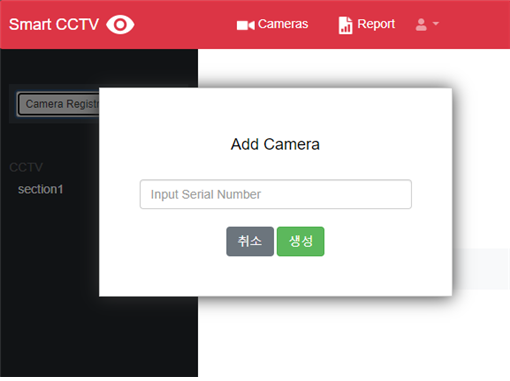
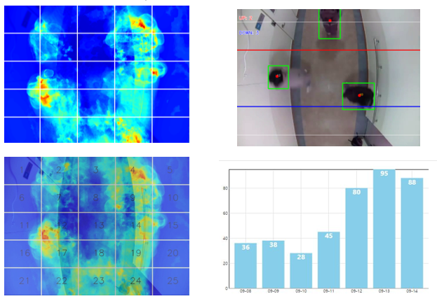

"OpenCCTV"
=========
- ### 프로젝트 소개
  ```
  OpenCCTV 시스템은 라즈베리파이의 리눅스 기반으로 사용자가 원하는 곳에 설치하고
  앱과 웹으로 연동하여 실시간으로 스트리밍 되는 CCTV 영상을 확인할 수 있는 시스템이다.
  ```
- ### 프로젝트 설명
  ```
  * 사용자가 설치한 CCTV 기기를 앱과 웹에서 연동하여 스트리밍 되는 영상을 실시간으로 확인할 수 있다.
  * 침입 탐지 시 사용자에게 알림 및 메일을 전송하여 안내한다. 
  * 피플카운팅, 히트맵을 통한 데이터 시각화 정보를 제공한다.
  ```  
- ### 활용 방안
  ```
  * 스트리밍 서비스로 실시간 상황을 모니터링한다.
  * 침입탐지 서비스를 통해 위험을 감지한다. 
  * 히트맵과 피플카운팅의 지능형 영상 분석 서비스를 매장 등 마케팅으로 활용가능하다.
  ```  
  
 - ### 사용법
    #### > 회원가입 및 로그인
    ```
      * 서비스 이용을 위한 회원가입 및 로그인
    ```
     
	 
     
    ####  > 카메라 등록 및 모니터링
     ```  
      * 좌측 메뉴에서 Camera Register 버튼을 눌러 카메라를 등록한다. 
      * 카메라 등록 후 홈 화면에서 모니터링 되는 화면을 확인한다. 
     ```
    
     
    #### > 영상 분석 및 시각화
    ```
      * 고객의 동선을 촬영 후 수치화하여 제공하는 히트맵 기능
	  * 출입하는 고객 수를 카운트하여 그래프로 시각화
    ```
    
	 
	#### > 침입 탐지 알림
    ```
      * 설치된 CCTV에 침입이 탐지되면 제작된 앱의 푸시알림과 사용자의 메일로 이미지를 전송한다.
    ```
    


